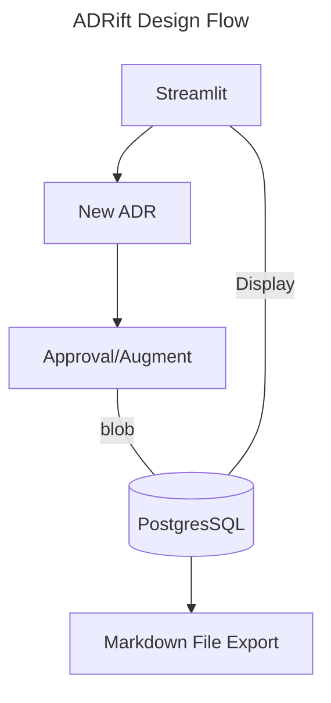

# ADRift

Navigating Architectural Decisions with Ease.



## Encryption

To encrypt the credentials and other values in the config files, you can run the
Makefile commands.

NOTE: Before running the commands, you will need to generate the keys.

```bash
bash scripts/encryption/create_keys.sh
```

Once the keys are created, we will need to run the `.sops.yaml` augmentation.