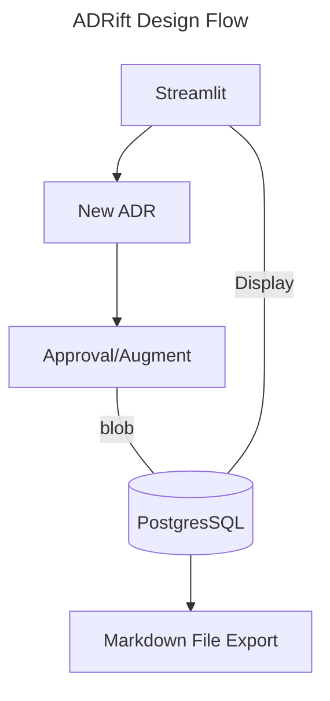

# PyOps ADRift Official Documentation

This is the Official Documentation site for ADRift, an ADR Document Management Tool for navigating
Architectual Decisions with ease.

```mermaid
---
title: ADRift Design Flow
---

flowchart TB;
    st[Streamlit] --> new-adr[New ADR] --> Approval
    Approval[Approval/Augment] -- blob --- database[(PostgresSQL)] -- Display --- st
    database --> md[Markdown File Export]

```
